<div id="top"></div>


<!-- PROJECT LOGO -->
<br />
<div align="center">
  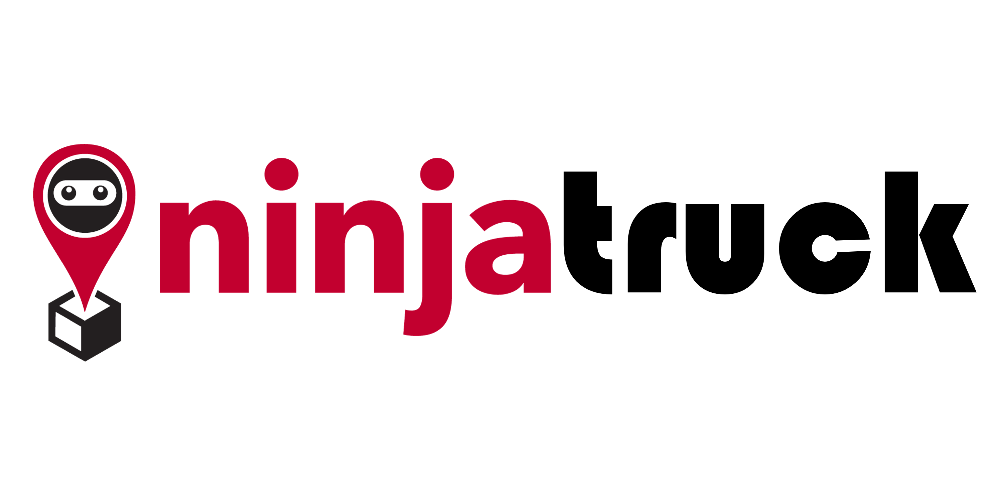

  <p align="center">
    This outlines the project codebase for AY2021/2022 Semester 2 IS213 ESD - G5T7 
  </p>
</div>

<!-- ABOUT THE PROJECT -->
## About The Project
NinjaTruck aims to be the last mile delivery management solution for delivery drivers. The application covers the most essential features a delivery driver will need when carrying out their day to day responsibilities of delivering a parcel to customers. 

### Technical Diagrams
<div align="center">
	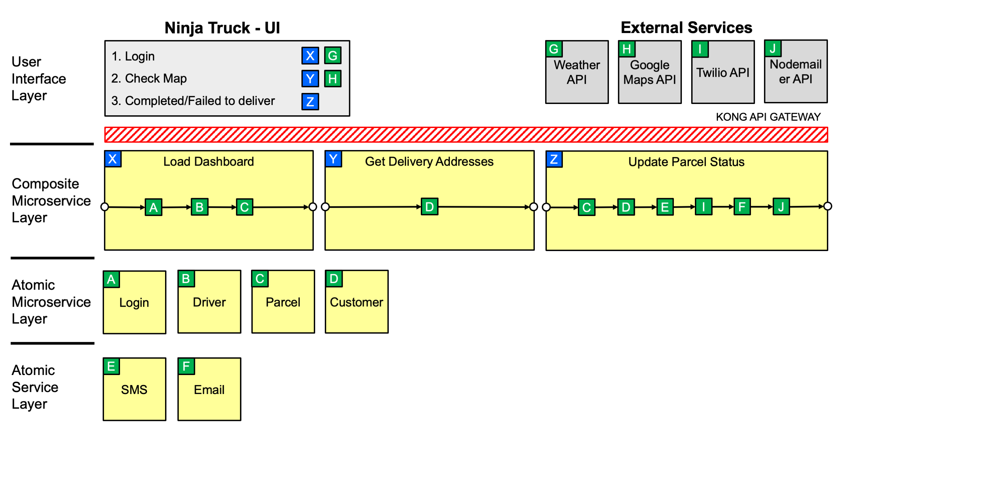
	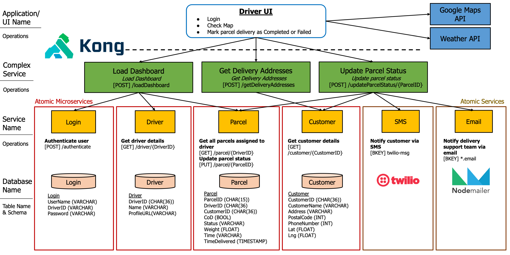
</div>

<p align="right">(<a href="#top">back to top</a>)</p>


## Built With

### Frontend
* [Vue.js](https://vuejs.org/)
* [Quasar](https://quasar.dev/)

### API Gateway
* [KONG](https://konghq.com)

### Backend
* [Python](https://python.org/)
* [Node.js](https://nodejs.org/)
* [Java Spring Boot](https://spring.io/)

### Message Brokers
* [RabbitMQ](https://rabbitmq.com)
* [Apache Kafka](https://kafka.apache.com)

### DevOps
* [Docker](https://docker.com)
* [Kubernetes](https://kubernetes.io/)
* [Octant](https://octant.dev/)

### Deployment
* [Tanzu Community Edition](https://tanzucommunityedition.io/)

### External APIs used
* [Weather API](https://openweathermap.org/current)
* [Google Maps API](https://www.npmjs.com/package/vue2-google-maps)
* [Twilio API](https://www.twilio.com/docs/sms/api/message-resource)
* [Nodemailer API](https://nodemailer.com)


<p align="right">(<a href="#top">back to top</a>)</p>


<!-- GETTING STARTED -->
## Getting Started
### Backend
Make sure you have a clean environment with no other containers as it can possibly conflict with this project’s ports mapping, image or container naming/labeling. Make sure that the Kong container and image is also deleted along with its network to set up a new kong configuration.
1. From the directory ./IS213-driver-app, open the terminal and enter `docker compose up` 
2. Access [http://localhost:1337](http://localhost:1337) in a browser to create an admin user for Konga
  ```
  Username: admin
  Email:    <your email address>
  Password: adminadmin
  ```
3. Sign in to continue
4. Connect Konga to Kong by creating a new connection
  ```
  Name: default
  Kong Admin URL: http://kong:8001
  ```
5. Go to Snapshots located on bottom right of the sidebar
6. Select IMPORT FROM FILE and import `./tools/kongSnapshot.json`
7. Click on DETAILS for the new snapshot created which ends with Ninjatruck
8. Select RESTORE, tick all of the boxes, and click on IMPORT OBJECTS
9. Repeat step 8 until there is only 1 failed item left being under key-auths
10. Select CONSUMERS on the side bar and select driver
11. Click CREDENTIALS and select API KEYS
12. Select CREATE API KEY and key in: `BtqGD0VZBhHgFiIm2fbfA5zdzXmN6Coz` and SUBMIT

## Prerequisites
* Docker version - 20.10.13
* Node - v16.13.0

Ensure you are running the same version by running the packages with `--version` in the terminal


<!-- USAGE EXAMPLES -->
## Usage
1. Open folder in vscode and open terminal
2. Install required dependencies 
  ```sh
	$ cd Frontend
	$ npm install
  ```
3. Launch NinjaTruck Application
  ```sh
	$ quasar dev
  ```
4. In browser, tap f12 to open console (as platform is only compatible for mobile)

## Scenario 1
Driver logs in and views his dashboard

<div align="center">
	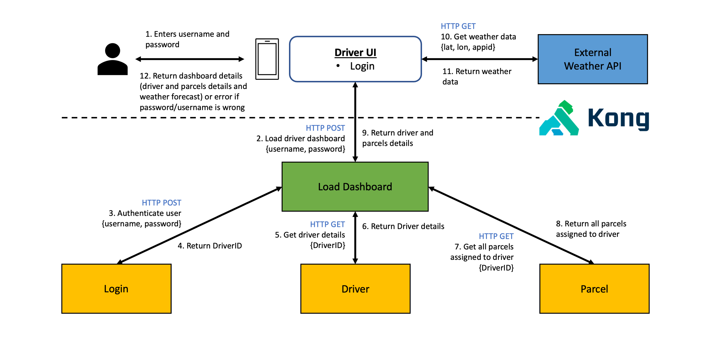
</div>
<div align="center">
	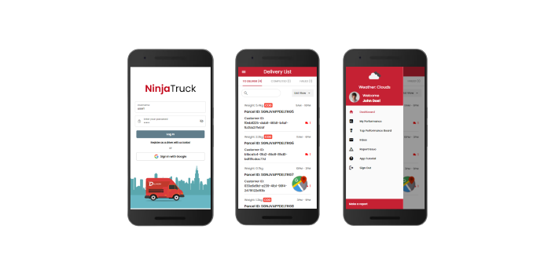
</div>

### Beyond the Lab
1. KONG is used as our API Gateway mainly for security implementation. Kong keeps the internal microservices from being directly exposed to external clients. 3 Plugins was also used to configure Kong:
* Kong’s Bot detection and rate limiting was used to prevent any bot attacks, DoS attack, and limit login attempts in case an attacker tries to brute force through the login. 
* Key-auth plugin was also used to add another layer of security by allowing only users with an api key belonging to Driver type consumer to access the microservices through kong.
2. Driver microservice is coded in Java SpringBoot. This is to highlight that the microservices are  language agnostic.
3. To handle exceptions in business logic, Error handling is implemented if username or password is incorrect when logging in. User will be notified of the incorrect username or password

## Scenario 2
Driver views map of all his parcels for delivery

<div align="center">
	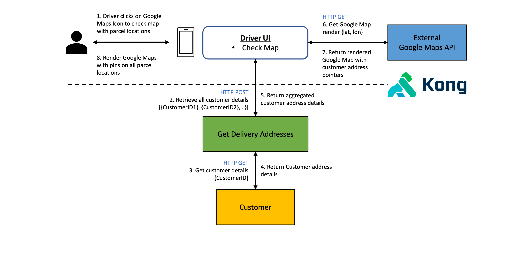
</div>
<div align="center">
	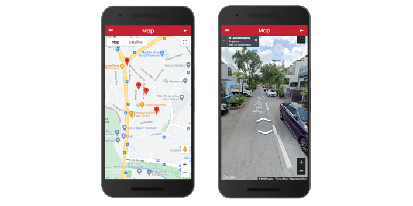
</div>

## Scenario 3
Driver completes a delivery of a parcel and marks it as either completed or failed

<div align="center">
	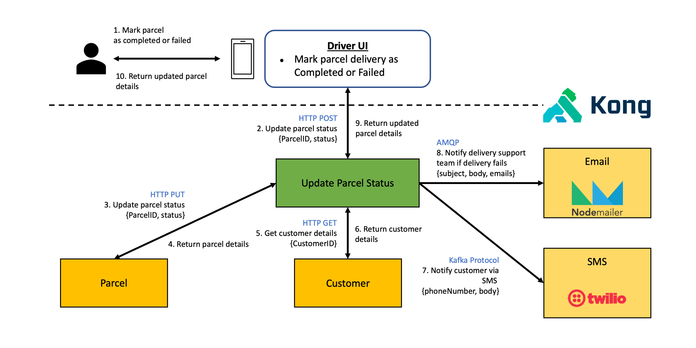
</div>
<div align="center">
	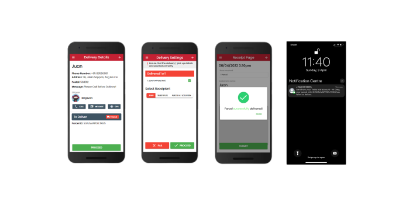
</div>
	
### Additional Points
1. Used Kafka as our message broker between Update Parcel Status and SMS microservice. Kafka is designed for holding and distributing large volumes of messages. Considering how there are hundreds of thousands of parcels delivered daily, kafka would be a good choice to handle the large amount of messages.
2. Kafka uses their own custom kafka protocol.
3. SMS microservice is built with Node.js. This is to highlight that the microservices are language agnostic.
4. To handle exceptions in business logic, Error handling is implemented if delivery has not been fulfilled. 

### Container Orchestration
* Each of the services in the red box represents a kubernetes pod containing our services. 
* Our Kong gateway acts as an entry point between the clients and our pods. With kubernetes, there is now the capability to scale our services easily. 
* With the use of either vertical or horizontal Pod Autoscaler, and their auto load-balancer, scaling through kubernetes is made much easier compared to load balancing and scaling in a pure docker environment.

<div align="center">
	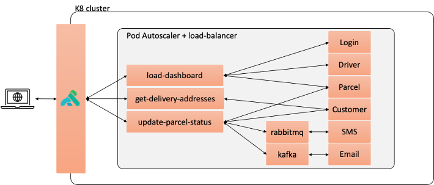
</div>

### Deployment
* Utilized Tanzu Community edition to provision and set up our aws infrastructure, and deploy our Kubernetes management cluster onto an ec2 instance, which would contain our downloaded packages and tooling. 
* From there, we created our workload cluster to run in another ec2 instance which would contain our application. To monitor our workload cluster, we use octant which helps to display the lifecycle of our pods in the cluster and the logs. 

<div align="center">
	
</div>
<div align="center">
	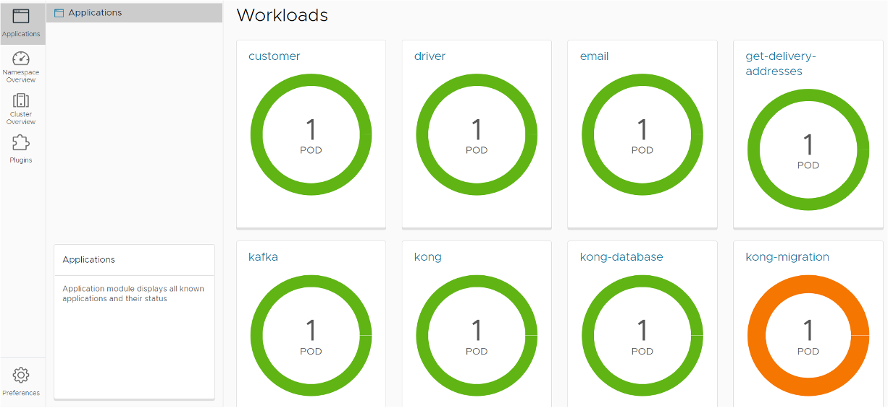
</div>


<!-- ACKNOWLEDGMENTS -->
## Acknowledgments

* [Greg G Tan Jun Kai](https://github.com/greggtan)
* [Hazel Ma Ruiqi](https://github.com/hazelmrq)
* [Ian Chia Chern Yi](https://github.com/theianchia)
* [Juan Sebastian](https://juanjaho.github.io/)
* [Quinn Cheong Shi Han](https://github.com/quinncheong)

<p align="right">(<a href="#top">back to top</a>)</p>

